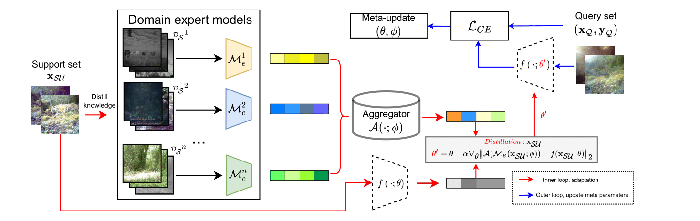
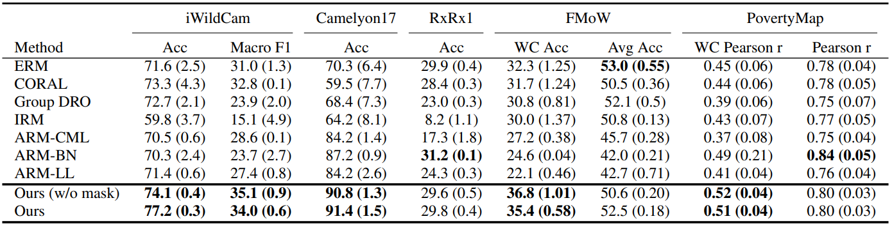

# Adapting to Domain Shift by Meta-Distillation from Mixture-of-Experts

This repository is the official implementation of [Meta-DMoE: Adapting to Domain Shift by Meta-Distillation from Mixture-of-Experts](https://arxiv.org/abs/2210.03885).

<div align="center">

</div>

## Requirements

The code was tested on python3.7 and CUDA10.1.

We recommend using conda environment to setup all required dependencies:

```setup
conda env create -f environment.yml
conda activate dmoe
```

If you have any problem with the above command, you can also install them by `pip install -r requirements.txt`.

Either of these commands will automatically install all required dependecies **except for the `torch-scatter` and `torch-geometric` packages** , which require a [quick manual install](https://pytorch-geometric.readthedocs.io/en/latest/notes/installation.html#installation-via-binaries).

## Training

We provide the training script for the following 4 datasets from the WILDS benchmark: `iwildcam`, `camelyon`, `rxrx1`, and `FMoW`. To train the models in the paper, run the following commands:

```Training
python run.py --dataset <dataset> --data_dir <path to data folder>
```

The data will be automatically downloaded to the data folder.

### Distributed Training for Expert Models

Although we are not able to provide Multi-GPU support for meta-training at this point, you could still consider training the expert models in a distributed manner by opening multiple terminals and running:

```Train Experts
python train_single_expert.py --dataset <dataset> --data_dir <path to data folder> --gpu <which GPU> --expert_idx <which expert in {0, ... , Num_Experts - 1}>
```

and add `--load_trained_experts` flag when running `run.py`.

## Evaluation

To evaluate trained models, run:

```eval
python run.py --dataset <dataset> --data_dir <path to data folder> --test
```

## Pre-trained Models

To reproduce the results reported in Table 1 in our paper, you can download pretrained models here and extract to `model/<dataset>` folder. Note that due to the size limit of cloud storage, we only uploaded checkpoints from one random seed per dataset, while the results reported in the table are aggregated across several random seeds.

- [iwildcam](https://drive.google.com/drive/folders/1mi-xInK5jXplmE4jo8oLSgHAYhsBe5sX?usp=sharing)
- [camelyon](https://drive.google.com/drive/folders/1Wbuzv0DMxtfYjhF51KgdQQGV2_PRNEDw?usp=sharing)
- [rxrx1](https://drive.google.com/drive/folders/1gsSFezrWbgKrU-nChC777DE3HFRnDkRx?usp=sharing)
- [fmow](https://drive.google.com/drive/folders/1PAgzr7e2kcTQaYRq8gZnYtrQGq3PSxCh?usp=sharing)

<div align="center">

</div>

## Citation
If you find this codebase useful in your research, consider citing:
```
@inproceedings{
    zhong2022metadmoe,
    title={Meta-{DM}oE: Adapting to Domain Shift by Meta-Distillation from Mixture-of-Experts},
    author={Tao Zhong and Zhixiang Chi and Li Gu and Yang Wang and Yuanhao Yu and Jin Tang},
    booktitle={Thirty-Sixth Conference on Neural Information Processing Systems (NeurIPS)},
    year={2022}
}
```
